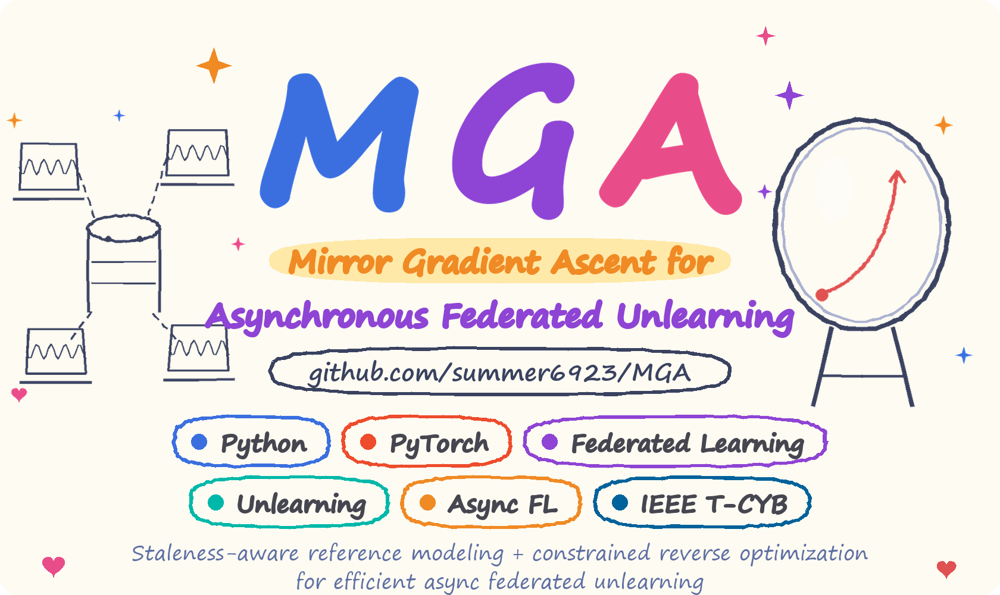

<div align="center">



### ✨ Forget Selectively · Learn Better · Together ✨

> **Staleness-aware reference modeling + constrained reverse optimization
> for efficient asynchronous federated unlearning.** 🪞

</div>

---

<div align="center">

</div>

| | |
|:---|:---|
| 🌱 **No affected-group retraining**<br>Unlearn target clients *without* retraining their whole group. | 🗄️ **Staleness-aware reference model**<br>Retained clients with different training speeds contribute with proper weights. |
| 🎯 **Adaptive reverse budget**<br>Each target client gets a personalized unlearning budget based on its own history. | 🚀 **Fast recovery with retained clients**<br>Aggregate returned models and quickly resume training. |

---

<div align="center">

</div>

*From forgetting to a better global model, in four steps:*

| 1️⃣ Grouped Async FL | 2️⃣ Reference Model | 3️⃣ Reverse Optimization | 4️⃣ Resume Training |
|:---:|:---:|:---:|:---:|
| Clients are **grouped by local training speed**. | A **staleness-aware reference** model is built from retained clients. | Each target client runs **budget-bounded local reverse updates**. | Returned models are **aggregated** and training quickly resumes. |

> 📌 This page intentionally keeps things high-level — the full formulation lives in the paper,
> with implementation notes in [`docs/implementation.md`](docs/implementation.md).

---

<div align="center">

</div>

*Effective unlearning, stronger models:*

| 🧊 CIFAR-10 | ✍️ MNIST | 🛒 Purchase |
|:---:|:---:|:---:|
| **~25% faster** than full retraining to reach the 70% accuracy mark. | **Highest final accuracy** among no-retrain baselines. | **Backdoor robustness closest to retraining** in 15 / 18 settings. |

<sup>Full curves and the evaluation protocol are available in the paper and [`docs/`](docs).</sup>

---

<div align="center">

</div>

```bash
# Linux/POSIX · Python 3.11
git clone https://github.com/summer6923/MGA.git
cd MGA

# Install the PyTorch wheels matching your CUDA first, then the runtime deps
python -m pip install -r requirements.txt

# Run a fresh MGA experiment (the output directory must be new)
python run_mga.py --config configs/mga_cifar10_full.yml \
    --data-path ./data --output ./runs/cifar10 --gpu 0 --timeout 86400

# Validate the run
python validate_mga_run.py --run ./runs/cifar10 --device cuda:0
```

> ⚠️ **Note** — the launcher requires **Linux/POSIX**; use `--gpu ""` for CPU-only runs.

### 📦 Ready-to-run settings

| Dataset | Configuration | Model |
|:---:|:---:|:---:|
| MNIST | `configs/mga_mnist_full.yml` | LeNet-5 |
| CIFAR-10 | `configs/mga_cifar10_full.yml` | ResNet-18 |
| Purchase | `configs/mga_purchase_full.yml` | Transformer |

### 🗂️ Repository Layout

```text
📦 MGA
├── 🧠 mga/                # core algorithm & asynchronous FL runtime
├── ⚙️  configs/           # ready-to-run YAML configs (MNIST · CIFAR-10 · Purchase)
├── 📚 docs/               # configuration & implementation notes
├── 🛠️  scripts/           # data download & evaluation helpers
├── 🚀 run_mga.py          # one-command experiment launcher
└── ✅ validate_mga_run.py # post-run validation & metrics
```

---

<div align="center">

</div>

<div align="center">

<a href="docs/implementation.md"></a> <a href="docs/configurations.md"></a> <a href="NOTICE"></a>

</div>

---

<div align="center">

</div>

If MGA contributes to your research, please consider citing:

```bibtex
@software{MGA_2026,
  title  = {MGA: Mirror Gradient Ascent for Asynchronous Federated Unlearning},
  author = {summer6923},
  year   = {2026},
  url    = {https://github.com/summer6923/MGA}
}
```

<sub>📖 The paper's BibTeX entry will be added upon publication.</sub>

---

<div align="center">

> ### 💬 *"Selective Forgetting for a More Trustworthy Future."*
> If you find MGA useful, please consider giving it a **⭐** — thanks for your interest! 🤖💙


</div>
